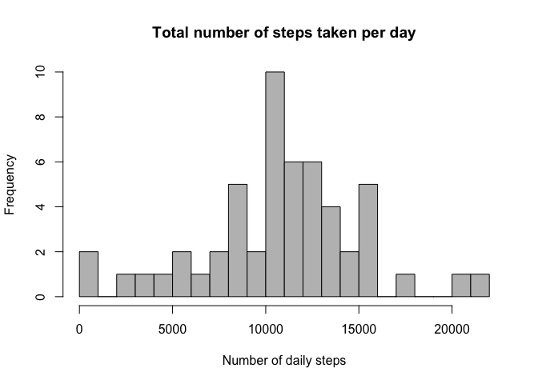
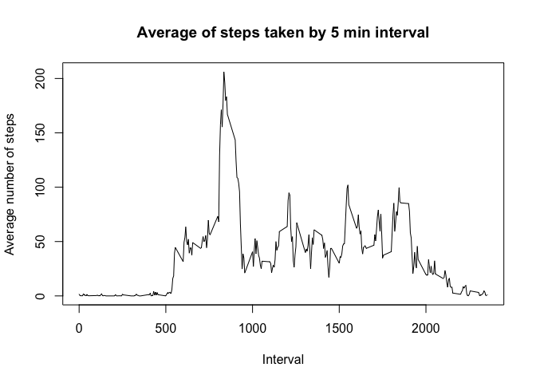
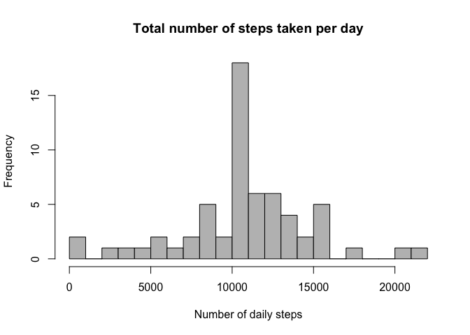
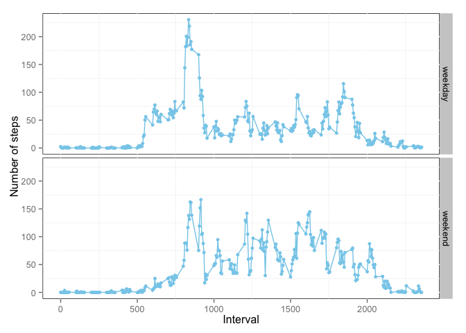

# Reproducible Research: Peer Assessment 1
Laure Casanova  
20 septembre 2015  


## Loading and preprocessing the data

Please note that you should set your working directory before running the code
Also the packages dplyr and ggplot2 should be installed before running the code

We start by loading the two packages we will need

```r
library(dplyr)
```

```
## 
## Attaching package: 'dplyr'
## 
## The following objects are masked from 'package:stats':
## 
##     filter, lag
## 
## The following objects are masked from 'package:base':
## 
##     intersect, setdiff, setequal, union
```

```r
library(ggplot2)
```

We first load the csv file, the original file is currently available at the following
adress "https://d396qusza40orc.cloudfront.net/repdata%2Fdata%2Factivity.zip"

```r
table1 <- read.csv("./activity.csv")
```

## What is mean total number of steps taken per day?

To address this question, we use the dplyr package to get the average and median number of steps taken per day

```r
daily_steps <- table1 %>% 
        na.omit() %>%
        group_by(date) %>%
        mutate(daily_steps = sum(steps)) %>% 
        distinct(date, daily_steps) %>%
        ungroup() %>%
        mutate(average_daily_steps = mean(daily_steps)) %>%
        mutate(median_daily_steps = median(daily_steps)) %>%
        select(date, daily_steps, average_daily_steps,median_daily_steps) %>%
        print
```

```
## Source: local data frame [53 x 4]
## 
##          date daily_steps average_daily_steps median_daily_steps
## 1  2012-10-02         126            10766.19              10765
## 2  2012-10-03       11352            10766.19              10765
## 3  2012-10-04       12116            10766.19              10765
## 4  2012-10-05       13294            10766.19              10765
## 5  2012-10-06       15420            10766.19              10765
## 6  2012-10-07       11015            10766.19              10765
## 7  2012-10-09       12811            10766.19              10765
## 8  2012-10-10        9900            10766.19              10765
## 9  2012-10-11       10304            10766.19              10765
## 10 2012-10-12       17382            10766.19              10765
## ..        ...         ...                 ...                ...
```

Then we make a histogram of the total number of steps taken per day. 

```r
hist(daily_steps$daily_steps,
     breaks = 25,
     col = "grey", 
     main = "Total number of steps taken per day",
     xlab = "Number of daily steps"
)
```

 


We then calculate and report the mean and median of the total number of steps taken per day. We notice that these values are pretty much similar to the ones we had with the missing values. The median is very slightly smaller.

```r
average_daily_steps = mean(daily_steps$daily_steps)
print(average_daily_steps)
```

```
## [1] 10766.19
```

```r
median_daily_steps = median(daily_steps$daily_steps)
print(median_daily_steps)
```

```
## [1] 10765
```


## What is the average daily activity pattern?

We create a new table in which we get the average number of steps taken by interval

```r
time_series <- table1 %>% 
        na.omit() %>%
        group_by(interval) %>%
        mutate(mean_steps_per_interval = mean(steps)) %>%
        distinct(interval, mean_steps_per_interval) %>%
        select(interval, mean_steps_per_interval) %>%
        print
```

```
## Source: local data frame [288 x 2]
## Groups: interval
## 
##    interval mean_steps_per_interval
## 1         0               1.7169811
## 2         5               0.3396226
## 3        10               0.1320755
## 4        15               0.1509434
## 5        20               0.0754717
## 6        25               2.0943396
## 7        30               0.5283019
## 8        35               0.8679245
## 9        40               0.0000000
## 10       45               1.4716981
## ..      ...                     ...
```


And we use the table we just created to make a time series plot of the 5-minute interval and the average number of steps taken, averaged across all days.

```r
plot(time_series$interval,time_series$mean_steps_per_interval, 
     type="l",
     main = "Average of steps taken by 5 min interval",
     xlab = "Interval",
     ylab = "Average number of steps",
     cex.lab = 1,
     cex.axis = 1
)
```

 


## Imputing missing values

We start by calculating and reporting the total number of missing values in the initial dataset

```r
missing <- sum(is.na(table1$steps))
print (missing)
```

```
## [1] 2304
```

Then we replace the missing values by the average number of steps taken on the corresponding interval

```r
replace_missing <- time_series[,2]

no_missing <- cbind(table1, replace_missing) %>%
        mutate(no_missing_steps =ifelse(is.na(steps), mean_steps_per_interval , steps))
        print
```

```
## function (x, ...) 
## UseMethod("print")
## <bytecode: 0x7fdacb8a5948>
## <environment: namespace:base>
```

Once the missing values have been replaced, we go on to calculating the average and the median of the number of steps taken

```r
no_missing_daily_steps <- no_missing %>%
        group_by(date) %>%
        mutate(daily_steps = sum(no_missing_steps)) %>% 
        distinct(date, daily_steps) %>%
        ungroup() %>%
        mutate(average_daily_steps = mean(daily_steps)) %>%
        mutate(median_daily_steps = median(daily_steps)) %>%
        select(date, daily_steps, average_daily_steps,median_daily_steps) %>%
        print 
```

```
## Source: local data frame [61 x 4]
## 
##          date daily_steps average_daily_steps median_daily_steps
## 1  2012-10-01    10766.19            10766.19           10766.19
## 2  2012-10-02      126.00            10766.19           10766.19
## 3  2012-10-03    11352.00            10766.19           10766.19
## 4  2012-10-04    12116.00            10766.19           10766.19
## 5  2012-10-05    13294.00            10766.19           10766.19
## 6  2012-10-06    15420.00            10766.19           10766.19
## 7  2012-10-07    11015.00            10766.19           10766.19
## 8  2012-10-08    10766.19            10766.19           10766.19
## 9  2012-10-09    12811.00            10766.19           10766.19
## 10 2012-10-10     9900.00            10766.19           10766.19
## ..        ...         ...                 ...                ...
```

Then we make a histogram of the total number of steps taken each day after replacing the missing values

```r
hist(no_missing_daily_steps$daily_steps,
     breaks = 25,
     col = "grey", 
     main = "Total number of steps taken per day",
     xlab = "Number of daily steps"
)
```

 

Then we calculate the average and median

```r
average_daily_steps2 = mean(no_missing_daily_steps$daily_steps)
print(average_daily_steps2)
```

```
## [1] 10766.19
```

```r
median_daily_steps2 = median(no_missing_daily_steps$daily_steps)
print(median_daily_steps2)
```

```
## [1] 10766.19
```


## Are there differences in activity patterns between weekdays and weekends?

We then go on to processing the data to see if there are any differences in activity patterns between weekdays and weekends

```r
average_day_type <- no_missing %>%
        select(date, interval, no_missing_steps) %>%
        mutate(weekday = weekdays(as.Date(date))) %>%
        mutate(day_type = ifelse(weekday == "Samedi"|weekday == "Dimanche", "weekend", "weekday")) %>%
        group_by(day_type, interval) %>%
        mutate(average_day_type = mean(no_missing_steps)) %>%
        distinct(day_type, interval, average_day_type) %>%
        select(day_type, interval, average_day_type) %>%
        print
```

```
## Source: local data frame [576 x 3]
## Groups: day_type, interval
## 
##    day_type interval average_day_type
## 1   weekday        0       2.25115304
## 2   weekday        5       0.44528302
## 3   weekday       10       0.17316562
## 4   weekday       15       0.19790356
## 5   weekday       20       0.09895178
## 6   weekday       25       1.59035639
## 7   weekday       30       0.69266247
## 8   weekday       35       1.13794549
## 9   weekday       40       0.00000000
## 10  weekday       45       1.79622642
## ..      ...      ...              ...
```

And we make a plot to show separately the steps taken by interval on the weekdays and weekends. The plot clearly shows that there are indeed differences in the activity patterns.

```r
p <- ggplot(average_day_type,aes(interval, average_day_type)) 
p <- p + geom_point(pch = 20, size=2, color = "skyblue")
p <- p + facet_grid(day_type ~ .)
p <- p + xlab(label="Interval")
p <- p + ylab(label="Number of steps")
p <- p + geom_line(linetype='solid', color = "skyblue")
p <- p + theme(legend.position=c(0.85, 0.5), legend.title=element_blank(), panel.background = element_rect(fill = 'white', colour = 'black'))
print(p)
```

 
